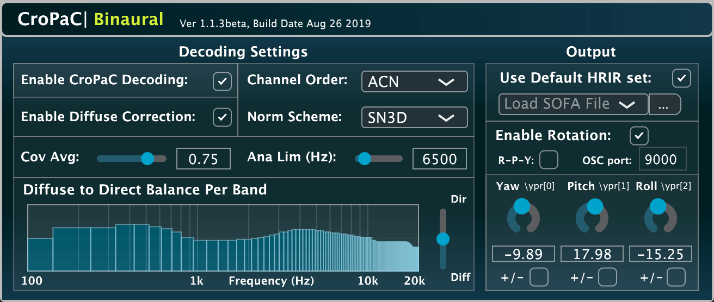

# CroPaC-Binaural

A VST plug-in implementation of a parametric Ambisonic decoder for headphones [1], based on the Cross-Pattern Coherence (CroPaC) spatial filter [2]. 



* [1]  McCormack, L., and Delikaris-Manias, S. (2019). **Parametric First-order Ambisonic Decoding for Headphones Utilising the Cross-Pattern Coherence Algorithm**.
In Proceedings of the 1st EAA Spatial Audio Signal Processing Symposium, Paris, France, September 6-7th 2019.
* [2] Delikaris-Manias, S., and Pulkki, V. (2013). **Cross pattern coherence algorithm for spatial filtering applications utilizing microphone arrays**. IEEE Transactions on Audio, Speech, and Language Processing, 21(11), 2356-2367.

## Pre-built plug-in

The plug-in may be downloaded from [here](http://research.spa.aalto.fi/projects/sparta_vsts/) [Mac OSX (10.10 or higher), Linux (x86_64), and Windows (64-bit)].

## Building the plug-in yourself

First clone the repository (including submodules) with:

```
git clone --recursive https://github.com/leomccormack/CroPaC-Binaural
# or if you have already cloned the repository, update with:
git submodule update --init --recursive
git pull --recurse-submodules
```

## Prerequisites 

The JUCE [modules](https://github.com/WeAreROLI/JUCE/releases) and [VST2_SDK](https://web.archive.org/web/20181016150224/https://download.steinberg.net/sdk_downloads/vstsdk3610_11_06_2018_build_37.zip), must be placed in the 'SDKs' folder like so:

```
SDKs/modules 
SDKs/VST2_SDK
```

**MacOSX, Windows and Linux (x86_64/amd64) versions**: also require a custom Intel MKL library. Details on how to acquire this library may be found [here](https://github.com/leomccormack/Spatial_Audio_Framework/blob/master/CUSTOM_INTEL_MKL_INTRUCTIONS.md). 

**Raspberry Pi (ARM) versions** instead require OpenBLAS and LAPACKE libraries:

```
sudo apt-get update
sudo apt-get install liblapack3 liblapack-dev libopenblas-base libopenblas-dev liblapacke-dev
```

**Linux (amd64/ARM) users** must also install the following libraries (the former line for JUCE, the latter line for the Spatial_Audio_Framework):

```
sudo apt-get install x11proto-xinerama-dev libwebkit2gtk-4.0-dev libgtk-3-dev x11proto-xext-dev libcurl4-openssl-dev libasound2-dev
sudo apt-get install libhdf5-dev libnetcdf-dev libnetcdff-dev
```

## Building the plug-in

When saving the .jucer files with the Projucer App, Visual Studio (2015/2017) solutions, Xcode project files, Linux Makefiles (amd64), and Raspberry Pi Linux Makefiles (ARM) are placed in:

```
audio_plugins/_CroPaC_binaural/make/
```

To generate project files for other IDEs, you may open and configure the included .jucer files accordingly.

## Building via script

**Linux/MacOSX users** may run the included "audio_plugins/build-plugin.sh" script via the Terminal, to build the plug-in:
```
bash build-plugin.sh all
```

**Windows users** may run the included "audio_plugins/build-plugin.bat" script (with "x64 Developer Command Prompt for VS.exe"), to build the plug-in:

```
build-plugin.bat <path/to/Projucer.exe>
```

## Authors

* **Leo McCormack** - C/C++ programmer and algorithm design  (contact: leo.mccormack@aalto.fi)
* **Symeon Delikaris-Manias** - algorithm design  

## License

Note that the CroPaC spatial filter was originally proposed in 2013 for single channel output enhancing applications, and is covered by this patent:

* Delikaris-Manias, S, and Pulkki V. [**"Method for spatial filtering of at least one sound signal, computer readable storage medium and spatial filtering system based on cross-pattern coherence."**](https://patents.google.com/patent/US9681220B2/en) U.S. Patent Application No. 14/648,379

If you wish to use the algorithm for a product, or for other commercial purposes, please contact the authors. The authors do, however, grant permission for commerical usage of this VST plug-in. The code for which is licensed under the GPLv3 License - see the [LICENSE](LICENSE) file for details.
