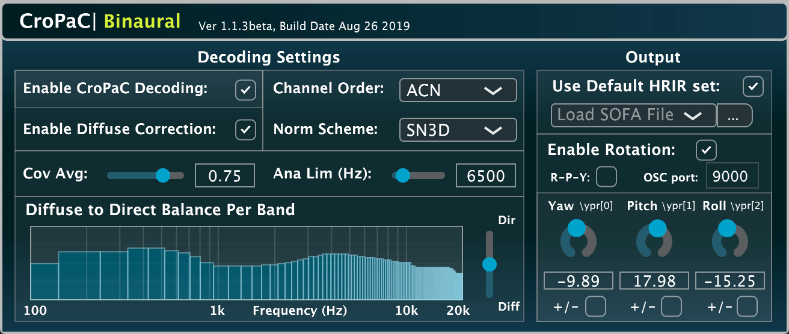

# CroPaC-Binaural

A VST plug-in implementation of a parametric Ambisonic decoder for headphones [1], based on the Cross-Pattern Coherence (CroPaC) spatial post-filter. Developed using [JUCE](https://github.com/WeAreROLI/JUCE/) and the [Spatial_Audio_Framework](https://github.com/leomccormack/Spatial_Audio_Framework).



* [1]  McCormack, L., and Delikaris-Manias, S. 2019. [**Parametric First-order Ambisonic Decoding for Headphones Utilising the Cross-Pattern Coherence Algorithm**](docs/mccormack2019parametric.pdf).
In Proceedings of the 1st EAA Spatial Audio Signal Processing Symposium, Paris, France, September 6-7th 2019.

## Pre-built plug-in

The plug-in may be downloaded from [here](http://research.spa.aalto.fi/projects/sparta_vsts/) [Mac OSX (10.10 or higher), Linux (x86_64), and Windows (64-bit)].

## Building the plug-in yourself

First clone the repository (including submodules) with:

```
git clone --recursive https://github.com/leomccormack/CroPaC-Binaural
# or if you have already cloned the repository, update with
git submodule update --init --recursive
```

## Prerequisites 

The [VST2_SDK](https://web.archive.org/web/20181016150224/https://download.steinberg.net/sdk_downloads/vstsdk3610_11_06_2018_build_37.zip) should be placed in the 'SDKs' folder like so:
```
SDKs/VST2_SDK
```

By default, **MacOSX, Linux and Windows (x86_64/amd64)** users need to install [Intel oneAPI](https://www.intel.com/content/www/us/en/developer/tools/oneapi/base-toolkit-download.html) (MKL and IPP) and run the **install-safmkl**.sh/.bat and **install-safipp**.sh/.bat scripts found in SDKs/Spatial_Audio_Framework/scripts. Whereas, **Raspberry Pi (ARM)** users instead require OpenBLAS and LAPACKE libraries:
``` 
sudo apt-get install liblapack3 liblapack-dev libopenblas-base libopenblas-dev liblapacke-dev
```
Note, however, that alternative performance libraries may also be used, with more information provided [here](https://github.com/leomccormack/Spatial_Audio_Framework/blob/master/docs/PERFORMANCE_LIBRARY_INSTRUCTIONS.md).

**Linux (x86_64/amd64 and ARM)** users must also install the following libraries required by JUCE:

```
sudo apt-get install x11proto-xinerama-dev libwebkit2gtk-4.0-dev libgtk-3-dev x11proto-xext-dev libcurl4-openssl-dev libasound2-dev
```

## Building the plug-in via CMake 

The plug-in may be built with CMake (version 3.15 or higher):
 ```
 mkdir build
 cmake -S . -B build -DSAF_ENABLE_SOFA_READER_MODULE=1
 cd build
 make
 ```
 
Or for Visual Studio users (using x64 Native Tools Command Prompt as **administrator**):
```
cmake -S . -B build -G "Visual Studio 15 Win64" -DSAF_ENABLE_SOFA_READER_MODULE=1 
cd build
msbuild ALL_BUILD.vcxproj /p:Configuration=Release /m
```
Note: when installing CMake on Windows, make sure to allow the intaller to add CMake to the system PATH list or it won't be found.

## Building the plug-in without CMake

You may also manually open the .jucer file with the Projucer App and click "Save Project". This will generate Visual Studio (2015/2017) solution files, Xcode project files, Linux Makefiles (amd64), and Raspberry Pi Linux Makefiles (ARM), which are placed in:

```
audio_plugin/_CroPaC_Binaural_/make/
```

To generate project files for other IDEs, you may open and configure the included .jucer files accordingly.

## Contributors

* **Leo McCormack** - C/C++ programmer and algorithm design  (contact: leo.mccormack(at)aalto.fi)
* **Symeon Delikaris-Manias** - algorithm design  

## License

Note that the CroPaC spatial filter was originally proposed in 2013 for single channel output enhancing applications, and is covered by this patent:

* Delikaris-Manias, S, and Pulkki V. [**"Method for spatial filtering of at least one sound signal, computer readable storage medium and spatial filtering system based on cross-pattern coherence."**](https://patents.google.com/patent/US9681220B2/en) U.S. Patent Application No. 14/648,379

If you wish to use the algorithm for a commercial product (and not under the GPLv3 license), please contact the authors - see the [LICENSE](LICENSE) file for details.
